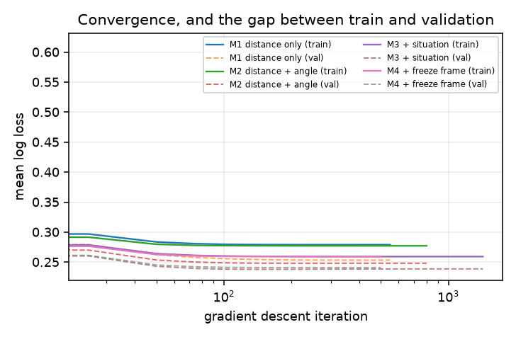
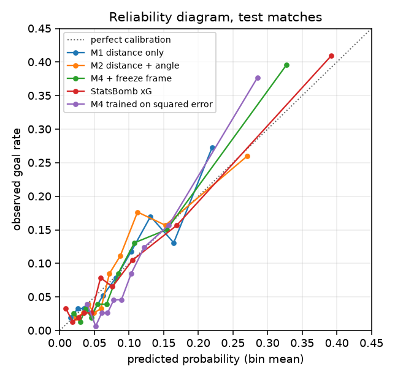
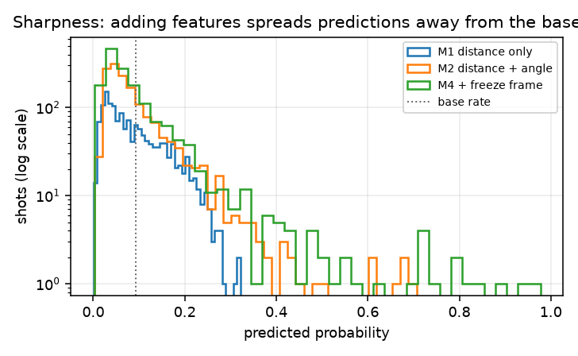
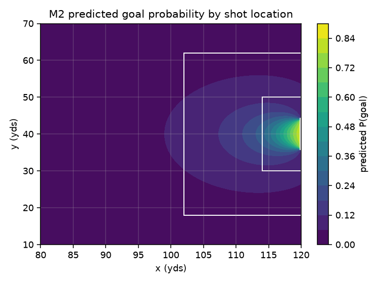

# Expected Goals from Scratch

### Logistic regression, and what log loss does not measure

**Sean Woods, 26107565**
31005 Machine Learning, Assignment 2, Spring 2026

---

## 1. Link to implementation

Google Colab notebook (publicly accessible, self contained, downloads its own data):

https://colab.research.google.com/github/seanw00ds/xg-from-scratch/blob/main/xg.ipynb

Source repository:

https://github.com/seanw00ds/xg-from-scratch

The notebook downloads the raw event data from StatsBomb, builds every feature, trains every model and reproduces every figure and table in this report. It runs top to bottom on a fresh runtime with no manual steps. The offline copy I demonstrate from is the same file.

---

## 2. Project report

### 2.1 Problem definition

A football team takes around twelve shots a game and scores around one. Judging a striker or a tactic on goals alone means judging them on a handful of events, most of which are decided by things nobody controls. Expected goals exists to fix that. Instead of counting what went in, you score every chance by how likely it was to go in, and you add those up.

So the task is this. Given one shot, produce the probability that it results in a goal.

The important part is that the output is a probability and not a label. Nobody wants a model that announces "this shot is a goal". Two identical chances from the same spot, one scored and one saved, are both normal. The model cannot know which way an individual shot falls, and it is not supposed to. What it is supposed to get right is the rate. Out of every hundred chances it rates at 0.30, about thirty should be scored.

**Training phase.**

| | |
|---|---|
| Input | `X`, a matrix of shape `(n, d)`, one row per historical shot, all real valued. `y`, a vector in `{0,1}^n`, where 1 means scored. |
| Hyperparameters | learning rate 0.5, iteration budget 20,000, L2 strength chosen by cross validation, random seed 7. |
| Output | `w`, a weight vector in `R^(d+1)`, with the bias in `w[0]`. Also the training mean and standard deviation of each feature, which deployment needs. |

**Deployment phase.**

| | |
|---|---|
| Input | one shot's feature vector `x` in `R^d`, built by the same feature code and scaled with the stored training statistics, not with anything measured at prediction time. |
| Output | one number in `(0, 1)`. No threshold is applied and no label is produced. |

Scaling with the stored training statistics matters more than it sounds. If you rescale a live shot using the mean of whatever batch it arrives in, the same shot gets a different xG depending on what else was hit that night.

### 2.2 The research question

Log loss is what the model is trained on. Calibration is what the model is for. Those are different things, and the question I set out to answer is where the difference shows up.

> An xG model is trained by minimising log loss over individual binary outcomes, but its real objective is calibration over groups of shots. Where does that gap bite, how do you detect it, and when you add features, are you buying calibration or only sharpness?

Sharpness is the model's willingness to move away from the base rate. A model that says 9% for every shot in the game is perfectly calibrated and completely useless. Calibration and sharpness are both needed and they are not the same quantity, which is why I measure them separately.

### 2.3 Data

StatsBomb Open Data, six men's senior international tournaments: the 2018 and 2022 World Cups, the 2020 and 2024 Euros, the 2024 Copa América and the 2023 AFCON. That is 314 matches and 7,509 shots, of which 668 were goals, a base rate of 8.9%.

I kept the population narrow on purpose. Mixing men's and women's football, or 1970s and modern matches, would mean fitting one model to several different games and then being unable to say which one the output describes.

Penalties are dropped. A penalty is the same shot every time and goes in about three quarters of the time, so leaving them in gives the model free log loss for spotting that the ball is on the spot.

Every shot in these competitions carries a StatsBomb 360 freeze frame, which records where every visible player was standing at the moment of the shot. That is what let me count defenders who are genuinely in the way rather than inferring it from the shot location.

### 2.4 Machine learning approach

**Hypothesis space.** Every function of the form `h(x) = σ(w·x + b)` with `σ(z) = 1/(1 + e^-z)`. Picking the weights picks one member out of that family. The sigmoid is doing real work here and not just tidying the output. It maps any real number into the open interval between 0 and 1, and it never reaches either end, which is correct because no shot is truly impossible and none is certain.

I started from the perceptron, which we covered in module 5, and the model followed from what was wrong with it. A perceptron returns a hard label, and I need a probability, so the output type is wrong immediately. Worse, shot data is not separable and never will be. The same chance is scored on Tuesday and saved on Saturday, so no straight line can put all the goals on one side. The perceptron's update rule never settles on data like that. Logistic regression keeps the same hypothesis space and changes the other two components. Swap the criterion for log loss and the algorithm for gradient descent, and the thing that could not converge becomes the thing that estimates a rate.

**Criterion.** Mean binary cross entropy, with an L2 penalty on the weights but not on the bias.

```
L(w) = (1/n) Σ -[ y log p + (1-y) log(1-p) ]  +  λ ||w||²
```

Two reasons for cross entropy over squared error. It is a proper scoring rule, so in expectation it is minimised exactly when the predicted probability equals the true probability, which is the definition of what I want. And its gradient does not die when the model is confidently wrong. I tested that second claim rather than asserting it, and the result is in section 2.6.

The bias is left out of the penalty deliberately. The bias is what sets the model's base rate, and shrinking it drags every prediction towards 0.5, which for a 9% event is nonsense.

**Algorithm.** Full batch gradient descent, with the bias folded in as a column of ones.

```
∇L = (1/n) Xᵀ (σ(Xw) − y) + 2λw
```

I derived this by hand before writing it. The sigmoid's derivative and the logarithm's derivative cancel, which is why the whole thing collapses to error times input. That cancellation is the reason cross entropy and the sigmoid are paired so often.

7,509 shots is small, so full batch costs nothing and the loss curve comes out smooth. Mini batch would add noise I would then have to explain.

**Features.** Four nested sets, each adding one block, so the results table reads as a controlled experiment instead of one jump from nothing to everything.

- **M1**, distance to the centre of the goal.
- **M2**, distance and angle. Angle is the angle the goalmouth subtends from the ball, computed from the two posts with the dot product. It carries information distance cannot. A shot from the byline six yards out is close to the goal but can hardly see any of it.
- **M3**, adding the situation: body part, whether it was first time, whether the player was under pressure, open goal, free kick, what kind of pass created the chance and what phase of play it came from. Categoricals are one hot encoded with one level dropped, otherwise the columns sum to a constant and the design matrix loses rank.
- **M4**, adding the freeze frame: defenders inside the triangle between the ball and the two posts, opponents in shot, how far the keeper has come off his line and how far he has drifted off centre.

All features are standardised using the training mean and standard deviation. Without it, distance runs from 0 to 100 and a binary flag runs from 0 to 1, so a single learning rate is either far too big for one or far too small for the other.

**Validation scheme.** Splits are by match, never by shot. Shots from the same game share a keeper, a pitch, a scoreline and a defensive shape, so they are not independent draws. If some shots from a match sit in training and the rest sit in test, the test set is no longer fresh and the number it reports is flattering. Whole matches move together: 188 matches to train, 62 to validate, 64 to test.

The L2 strength is chosen by five fold cross validation inside the training matches, again splitting by match. I report the standard deviation across folds as well as the mean, because a difference smaller than the spread between folds is not a result. That turned out to matter. For M2 the best and worst L2 differ by 0.008 in cross validated log loss while the fold to fold spread is 0.016, so for that model the choice of penalty is doing almost nothing, and I say so rather than dressing it up.

The test matches were used once, at the end.

### 2.5 Results

All figures are on the 64 test matches, 1,532 shots, 143 goals.

| Model | Log loss | Brier | ECE | Reliability | Resolution | ROC-AUC | Avg precision | Accuracy |
|---|---|---|---|---|---|---|---|---|
| M0 base rate | 0.3103 | 0.0846 | 0.0032 | 0.0000 | 0.0000 | 0.500 | 0.098 | 90.7% |
| M1 distance | 0.2792 | 0.0788 | 0.0187 | 0.0006 | 0.0059 | 0.738 | 0.248 | 90.7% |
| M2 + angle | 0.2774 | 0.0782 | 0.0181 | 0.0006 | 0.0060 | 0.745 | 0.251 | 90.7% |
| M3 + situation | 0.2605 | 0.0733 | 0.0156 | 0.0003 | 0.0104 | 0.782 | 0.343 | 91.0% |
| **M4 + freeze frame** | **0.2584** | **0.0733** | **0.0193** | **0.0007** | **0.0123** | **0.797** | **0.350** | **90.8%** |
| StatsBomb xG | 0.2481 | 0.0692 | 0.0125 | 0.0002 | 0.0130 | 0.803 | 0.405 | 91.2% |
| M4 on squared error | 0.2668 | 0.0744 | 0.0311 | 0.0017 | 0.0110 | 0.789 | 0.347 | 91.0% |

StatsBomb's own xG is in that table as a benchmark. It is a commercial model trained on millions of shots with features I do not have, including shot height and a goalkeeper positioning model. M4 lands within 0.011 log loss of it, which is the number that tells me the pipeline is sound.

**Accuracy is worthless here, and the table is the proof.** Predicting "no goal" for every shot scores 90.7%. My best model scores 90.8%, and M3, which is worse on every metric I actually care about, scores higher still at 91.0%. A metric where refusing to model anything captures almost all of the available score is not measuring the thing I care about. This is class imbalance doing what it always does, and it is why log loss, Brier and the calibration measures carry the argument instead.

**The weights make football sense.** In standardised units, distance comes out at −0.40 and angle at +0.39, so they are close to equally important and pull in opposite directions, which is what you would expect. Keeper off his line is next at +0.20, so a keeper caught up the pitch raises the chance. Defenders in the cone is −0.18, and being under pressure is −0.16. Headers carry a negative weight even after distance is accounted for, which matches the fact that a header is a worse contact than a foot. Nothing in the top of that list is surprising, and that is the point. A model this simple whose weights disagreed with football would be a model with a bug.

**Convergence.** Gradient descent converged in 501 iterations for M4 at a learning rate of 0.5, with the stopping rule triggering on a change in loss below 1e-9. The validation curve sits almost on top of the training curve. That closeness is the generalisation gap drawn out, and it is small because the hypothesis space is small. Thirty five features of linear capacity cannot memorise 4,435 shots even if the optimiser wanted to.



*Figure 1. Gradient descent converging for each model. Dashed lines are validation. The two curves for each model stay close, which is the generalisation gap drawn out.*



*Figure 2. Reliability diagram on the test matches. Points on the dotted line mean the stated probability matched the observed rate in that bin.*

**Calibration and sharpness move separately.** This is the main result. Going from M1 to M4, reliability sits still at 0.0006 and 0.0007, while resolution more than doubles, from 0.0059 to 0.0123. ECE is flat too, 0.0187 against 0.0193. The extra features bought sharpness, not honesty.

There is a structural reason. The model has a bias term and the criterion is a proper scoring rule, so gradient descent drives the average prediction to the base rate almost regardless of what the other weights do. Average calibration is close to free. Telling a 0.40 chance from a 0.05 chance is the part you pay for.



*Figure 3. Sharpness. Each block of features widens the spread of predictions away from the base rate, which is resolution increasing.*



*Figure 4. What M2 has actually learned about geometry, drawn over the attacking third. The band of high probability hugs the six yard box and collapses towards the byline, which is the angle term doing its job.*

### 2.6 Does the criterion matter?

Same hypothesis space, same optimiser, same features, same L2, only the loss changed, to mean squared error on the sigmoid output. The gradient then picks up an extra factor:

```
∇L = (2/n) Xᵀ [ (p − y) · p · (1 − p) ]
```

That `p(1−p)` term is the sigmoid's own derivative. Cross entropy cancels it and squared error does not. When the model is confidently wrong, say `p` near 1 while the shot was missed, `p(1−p)` is near zero, so the gradient nearly vanishes exactly where the error is largest. The update goes quiet when it should be loudest.

The experiment agrees. Trained on squared error, the same model gets worse log loss (0.2668 against 0.2584), worse Brier, and calibration error 61% higher (0.0311 against 0.0193). It also drifts high, predicting a mean of 0.106 on shots that went in at 0.093. Ranking is barely touched, ROC-AUC 0.789 against 0.797. The choice of criterion cost almost nothing in the ability to sort chances, and cost a lot in the honesty of the numbers on them, which for xG is the whole product.

---

## 3. Discussion

### 3.1 Where the loss stops serving the objective

M4's overall bias is −0.0004. Mean predicted xG 0.0929 against an observed rate of 0.0933. On paper that is as good as it gets.

It is also an average, and an average can be right while every part underneath it is wrong.

| Group | Shots | Predicted | Observed | Gap |
|---|---|---|---|---|
| All shots | 1,532 | 9.29% | 9.33% | −0.0 pp |
| Counter attacks | 69 | 15.1% | 21.7% | **−6.7 pp** |
| Free kicks | 64 | 2.8% | 6.3% | **−3.5 pp** |
| From a cross | 252 | 15.2% | 12.3% | **+2.9 pp** |
| Inside 12 yards | 368 | 17.4% | 19.0% | −1.6 pp |
| Beyond 20 yards | 687 | 4.2% | 2.9% | +1.3 pp |
| 12 to 20 yards | 477 | 10.3% | 11.1% | −0.8 pp |
| Headers | 267 | 11.3% | 12.0% | −0.7 pp |

The model systematically underrates chances from counter attacks and free kicks, and overrates crosses and long shots. Those errors cancel in the total, which is exactly why the total looked perfect.

This is the answer to the research question, and it is not an accident of this dataset. Log loss is a sum over individual rows. It has no concept of "counter attack" as a category, so a systematic underestimate in one situation and a matching overestimate in another are worth the same to the objective as getting both right. The criterion is blind to the grouping the user cares about. There is nothing in the loss that could detect it.

The cost is real. A side that presses high and scores in transition would be told its chances are worth less than they are, and judged by xG it would look like it was overperforming and due to regress, when in fact the model just cannot see what makes those chances good. The freeze frame count helps, but it is a still photograph. It cannot tell a settled back four from four defenders sprinting back at their own goal, and that is the entire difference between a counter attack and a normal attack.

Detecting it takes something the loss does not provide. I grouped the test predictions along football dimensions the model never saw as features, and compared predicted against observed in each group.

**How much of this is noise.** Not all of it is equally solid, and I know that because of an accident. An earlier version of my dataset was missing two matches, lost to download failures I had not noticed. On that dataset the counter attack gap was −6.0 points and crosses came out at −4.2, underrated. Recovering those two matches, about 0.8% more data, left counter attacks where they were but flipped the sign on crosses to +2.9. A finding that changes direction when you add 58 shots is not a finding. So the honest reading is this: the counter attack gap survives, it is the largest effect, it has a mechanism I can name, and it is stable across both versions of the data. Everything below about three points on a few hundred shots is inside the noise and I do not claim it. Free kicks at 64 shots are suggestive at best.

### 3.2 Limitations

The hypothesis space is linear in the features, so every interaction has to be built by hand. A cross to the back post and a cross cut back to the penalty spot are the same event to this model. That single restriction explains most of the remaining gap to StatsBomb, whose gradient boosted trees get interactions without being asked.

7,509 shots with 668 goals is not a lot. The effective sample size for a rare class is set by the positives, not the rows, and the subgroup analysis above shows what that costs: a group of 250 shots cannot settle a three point difference in rate.

International tournament football is its own population. Deploying this model on a youth or amateur match without refitting would be a mistake, because the base rate and the finishing quality are both different, and the bias term alone encodes the base rate of the training data.

The features are recorded by human analysts, so "under pressure" and "first time" carry some labelling noise that I have no way to measure.

Nothing in the model knows who took the shot. That is a deliberate choice, since xG is meant to describe the chance and not the finisher, but it does mean the model will under predict for elite finishers as a group.

### 3.3 What I would do next

Put the grouping into the criterion. If group calibration is what the model is judged on, add a penalty term for squared group bias to the loss, so the objective contains the thing the evaluation measures instead of hoping the average carries it. That is a change to `L` rather than to `H`, so the optimiser and the model stay exactly as they are.

Add interaction terms between angle, distance and defender count, which is the cheapest way to buy the flexibility a tree gets for free while keeping a model I can still read.

Fit the model separately per competition and compare the weights, to test whether a good chance means the same thing at the AFCON as it does at a World Cup.

---

## 4. Implementation log

### 4.1 Challenges and how I dealt with them

**One hot columns that did not match between splits.** The first run crashed with a shape mismatch, 29 columns against 30. The cause was that I was reading the categories off whichever split I happened to be encoding, and a rare assist type appeared in training but not in test. That silently changes the input space of the model between fit and predict. The fix was to derive the level list once from the training split and pass it through to every other split, so the columns are always the same columns in the same order. Worth noting that this would not have crashed if the missing level had been the last column of a wider matrix, it would just have produced wrong answers, which is the more dangerous version of the same bug.

**Two matches that silently went missing.** This is the one that nearly cost me. My download loop caught exceptions per match, printed a warning to stderr and carried on with an empty list, so two matches lost to transient SSL timeouts just quietly vanished. I only noticed because I ran the notebook end to end on a fresh machine and it reported 7,509 shots where my local dataset had 7,451. Every number in an earlier draft of this report came from a dataset two matches short of the one anybody else would get by running my code, and the results and the notebook would not have matched. The fix is three things: retry each download up to four times with backoff, raise rather than continue if it still fails, and assert at the end that the number of matches with shot events equals the number of matches requested. The wider lesson is that a failure that prints a warning and keeps going is worse than one that stops, because the run still produces a plausible looking answer.

**Two shots with no goalkeeper in the freeze frame.** These produced NaN, which spread through the whole M4 model and turned every metric into NaN. Dropping the rows was tempting and would have been wrong. A keeper missing from the frame usually means he is nowhere near his goal, and one of the two shots was scored while the other was blocked, so the pair is not something I can dismiss as noise in either direction. I imputed the keeper onto his line in the centre of the goal and added a binary flag recording that he was missing, so the information survives instead of being deleted.

**A degenerate calibration table.** The base rate baseline predicts the same number for every shot, so the quantile bin edges all collapsed to one value and the binning code returned an empty table, which then failed on a missing column. Fixed by detecting the case and putting everything in a single bin. Minor, but it is the kind of thing that only shows up because I bothered to evaluate the trivial baseline.

**The dataset change moved a result.** Recovering those two matches changed one of my subgroup findings, flipping the bias on shots from crosses from −4.2 points to +2.9. Nothing about the model or the code changed, only 58 extra shots. I have left that in section 3.1 rather than quietly reporting the new number, because it is the clearest evidence I have for how much of a subgroup table on this much data is noise, and it changed which parts of my own conclusion I am willing to defend.

**Convincing myself the gradient was right.** A wrong gradient still trains. It just trains to the wrong place, quietly. I checked mine against central differences on random data and got a maximum relative error of 4.55e-10, which is the level you expect from floating point alone. This check is in the notebook and it runs every time.

### 4.2 Use of AI tools

I used Claude throughout, which the subject encourages. The honest account of what it did and what I did:

**Where it did the work.** It wrote most of the boilerplate. The StatsBomb download with a thread pool, the matplotlib figure code, the pandas grouping in the subgroup table. None of that is machine learning content and I would have written it slower and uglier. It also suggested the Murphy decomposition of the Brier score, which I had not met before, and the point in triangle test for counting defenders in the shooting cone.

**Where I pushed back.** Its first suggestion for the project was a churn or housing prices dataset, which is the kind of thing a marker sees forty times. The xG framing and the calibration research question came from me knowing the sport well enough to know that the interesting part of xG is not whether it predicts goals, because it cannot, but whether the numbers are honest.

**What I checked rather than trusted.** The gradient derivation I did on paper first and then checked numerically, so the code agreeing with Claude was never the evidence. Every metric I wrote from scratch is cross checked against scikit-learn in the notebook, and my full gradient descent solution is compared against sklearn's LBFGS solver on the same objective, where the largest disagreement across all the weights is 0.0074. That comparison is also the reason I can claim convergence rather than assume it.

**Where using it cost me something.** The first version of the feature code it produced fitted the standardiser on the whole dataset before splitting. That is leakage, it is subtle, and it would have inflated my test results in a way I might not have noticed. I caught it because splitting before any statistic is computed is a rule I already had in my head from the validation lecture. That is the actual lesson about AI assistance in this subject. It produces code that runs, and running is not the same as correct, so the only protection is knowing what the code is supposed to be doing before you read it.

### 4.3 Knowledge gaps, stated honestly

**Average precision.** I implemented it as the step-wise sum of precision at each positive, which matches scikit-learn's convention to eight decimal places. I know what it measures and why it beats ROC-AUC under heavy imbalance. I do not have a solid grip on why this particular discrete sum is the preferred estimator rather than interpolating the precision recall curve and integrating it, beyond the explanation that interpolation is optimistically biased. I verified correctness against sklearn rather than deriving it.

**The Murphy decomposition.** I can state it, and I use it as the backbone of the calibration versus sharpness argument. I verified numerically that reliability minus resolution plus uncertainty reproduces the Brier score to floating point on my data, so I am confident the identity holds and that my implementation is right. I have not derived it myself. I also know that the decomposition depends on how the bins are chosen, and that with ten quantile bins on 1,509 shots the individual bin estimates are noisy, but I do not know how to put a confidence interval on reliability.

**The choice of L2 over L1.** I used L2 because it keeps the objective smooth and differentiable everywhere, which suits plain gradient descent. L1 would need a subgradient or proximal step. I understand that trade off. What I cannot argue well is whether L1's feature selection behaviour would actually have helped here given my one hot columns, and I did not test it.

**Why 0.5 is a good learning rate.** I chose it by trying a few values and watching the loss curves, not from any analysis of the curvature of the objective. I know that for a convex loss with standardised inputs there is a principled bound on the step size involving the largest eigenvalue of the Hessian, and I did not compute it. The empirical evidence that 0.5 is fine is that the loss decreases monotonically and the solution agrees with a proper second order solver, which is verification rather than understanding.
